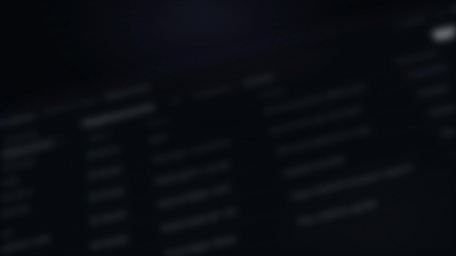
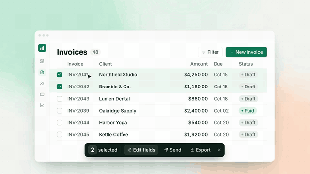
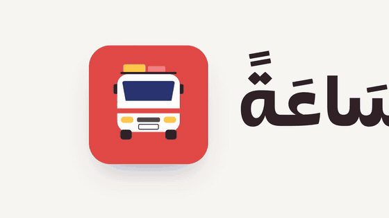
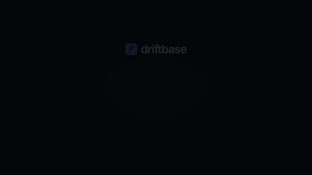

# Product Launch Motion Skill

A Claude Code skill that turns a product or feature into a **launch video generated entirely in code**: no footage, no stock, no After Effects. Claude interviews you about the launch, recommends the right video type, looks at your real product (through Claude in Chrome, or a screenshot shot list), rebuilds the screens in HTML with fictional data, animates them with GSAP and renders an MP4 with [HyperFrames](https://hyperframes.heygen.com).

The skill chooses from **12 launch video types**, or **rebuilds the motion of a reference video you love**. A voice-over through ElevenLabs is optional, in any language.

> Every example below was made by this skill for an **invented brand**. They show how one workflow adapts to very different brands, formats and launch sizes. Previews are silent. Each video is designed to work with sound off; music was removed for licensing reasons.

---

## Examples by type

| | Type | When to use it | Example |
|---|---|---|---|
|  | **T01 · Teaser / Countdown**<br>16:9 · 15 s | Before a launch: build curiosity, push a date or waitlist. Fragments only, never the whole product. | **Nimbo 2** (notes app). Dark rim-lit UI fragments cut faster and faster; "Write. Connect. Remember."; silence; the logo lands on the drop; "Coming March 12". |
|  | **T02 · Kinetic-Type Announcement**<br>1:1 · 18 s | Big news with little UI to show: a new model, a rename, pricing, a vision. | **Quillo 3** (AI writer). Huge stomping editorial words on the beat; "QUILLO 3 IS HERE." on the drop. |
|  | **T03 · UI-Motion Hero Reveal**<br>16:9 · 31 s | Major launch or big feature. The "Linear-style" film: a cinematic tour through the product. | **Driftbase** (deploy platform). `git push` → build → live preview URL → review → merge, on one continuous 3D camera; ends on a wall of previews. |
|  | **T04 · Feature Drop / Changelog**<br>16:9 · 9.5 s | Small feature, weekly changelog, in-app "What's new". One feature, one interaction, no intro. | **Tallyo** (invoicing). Bulk-select invoices → edit status → "5 invoices updated" → "Now in Tallyo". |
|  | **T05 · Release Roundup**<br>16:9 · 25 s | Quarterly or post-event "everything we shipped". | **Taskhive** (projects). "Everything we shipped in Q3": 4 numbered features, each a quick UI moment, then a bento recap. |
|  | **T06 · Before / After**<br>9:16 · 19.5 s | AI, automation, speed: show the work disappearing. | **Notewell** (AI meeting notes). A grey chaotic "before" → slider wipe on the drop → a clean auto-summary; "45 min → 2 min" (illustrative). |
|  | **T07 · Problem → Solution**<br>16:9 · 24.5 s | New product or category, when the audience doesn't know the pain yet. | **Shiftsy** (restaurant scheduling). "Who's covering Saturday?", chat chaos, no-shows, a messy spreadsheet → "Meet Shiftsy" → auto-fill, swap, publish. |
|  | **T08 · Use-Case Montage**<br>9:16 · 24 s | Horizontal products and AI assistants: one product, many jobs. | **Helmo** (AI for teams). Sales / Support / Marketing / Ops vignettes, each with a typed prompt → result, then a 2×2 recap. |
|  | **T09 · Integration / Partnership**<br>1:1 · 11.5 s | A new integration, marketplace listing or co-launch. | **Tallyo × Coinlane**. The logos lock up; the invoice is paid through the partner's checkout; status flips to Paid; "Available today". |
|  | **T10 · Metric / Milestone**<br>9:16 · 12 s | Users, funding, an anniversary, year in review. | **Sproutly** (habit app). An odometer lands on 1,000,000 on the drop, 3 sub-stats, a thank-you. |
|  | **T11 · Kinetic Shape Film**<br>16:9 · 49.5 s · 60 fps · Arabic VO | Hero launch or hook video: emotion first, then the product. The premium "brand film" style. | **Louagi** (Tunisian app to book a louage seat, Arabic voice-over). Waiting pain told in fast illustrated shots → infinite shape zoom into the logo → feature cylinder → icon dock → app walkthrough → AI assistant → ticket → logo. Built shot for shot from a frame-measured motion spec of a reference film. |
|  | **S · Launch-Week Series**<br>16:9 · 24 s | Five launches in five days. One template, a color per day. | **Driftbase Launch Week**. Teaser → Day 1…5 bumpers → "Five launches. One week." recap. |

The source of every example (`index.html` + beat list) is in [`skill/product-launch-motion/examples/`](skill/product-launch-motion/examples). Font and music assets are not included.

---

## Match a reference video

Got a launch video whose style you love? Give it to the skill:
1. **Detect scenes:** finds every cut and fast transition (`scripts/scene-scan.py`) and makes dense contact sheets around each one (`scripts/contact-sheets.sh`).
2. **Write a frame-measured `MOTION-SPEC.md`:** shot table, transitions, timings and eases, plus the palette sampled from the frames.
3. **Map your content shot for shot**, then write a voice-over script fitted to that rhythm.
4. **Build, then run QA:**
   - side-by-side frame comparison with the reference
   - a 60 fps render
   - a jump scan (`scripts/jump-scan.py`) that catches any frame that pops

It copies motion and structure, never the reference's brand, copy or photos.

## How it works

```
You: "Make a launch video for our new bulk-edit feature"
        │
1. Intake ─────────── Claude reads your site, then asks:
   │                  product, feature, pain, launch size, message, proof,
   │                  CTA, platform, brand assets, product access,
   │                  voice-over (+ language, ElevenLabs key), music
2. Recommend type ─── 2–3 options from the 11 types, each with the reason,
   │                  length, format and the matching example above → you pick
3. Product visuals ── Claude opens your product in your Chrome (you sign in,
   │                  browsing is read-only), or asks you for a precise
   │                  shot list of screenshots
4. Brand system ───── colors, fonts, logo, radii and motion personality as
   │                  CSS tokens
5. Storyboard ─────── scene table (time · text · visual · sound)
   │                  + VO script (if any) → you approve
6. Voice-over ─────── optional: ElevenLabs (eleven_v4), a natural calm voice,
   │                  one file per line, placed per scene
7. Build ──────────── HyperFrames HTML composition: UI rebuilt with fictional
   │                  data, GSAP motion, music drop aligned to the reveal
8. Review loop ────── `hyperframes check` (lint, layout, contrast) + snapshot
   │                  contact sheets → fix → render MP4
9. Deliver + learn ── your notes become brand rules for the next video

Motion follows a measured grammar (references/motion-grammar.md): 8-frame snap
entrances, continuous drift, spatial transitions only, an event every ~0.5 s, 60 fps.
```

### Principles baked in
- **Generated, not filmed.** Every type is buildable in code. Recreated UI keeps private data out and moves better than screenshots.
- **Sound-off first.** At most 8 words per card, hold times based on reading speed, a hook in 3 s, contrast checked automatically.
- **Honest claims.** No invented stats, quotes or logos. Illustrative numbers are labelled.
- **Taste rules learned from review**, for example: no glassy "sparkle" SFX; the music sits low under the voice; voices must sound natural, not synthetic; the VO script is approved before any audio is generated.

---

## Install

Requirements:
- [Claude Code](https://claude.com/claude-code)
- Node 18+
- ffmpeg
- HyperFrames skills: `npx hyperframes skills update`

Optional:
- Claude in Chrome (for product access)
- An ElevenLabs API key (for voice-over)

```bash
git clone https://github.com/ouerf-man/product-launch-motion-skill.git
cp -r product-launch-motion-skill/skill/product-launch-motion ~/.claude/skills/
```

Then in Claude Code:

```
Make a launch video for <feature> — here's our site: <url>
```

or call it directly with `/product-launch-motion`.

### Voice-over helper (standalone)
```bash
echo "ELEVENLABS_API_KEY=..." > .env && chmod 600 .env
node skill/product-launch-motion/scripts/elevenlabs.mjs voices --env .env
node skill/product-launch-motion/scripts/elevenlabs.mjs tts --env .env \
  --script lines.json --voice <voice_id> --out vo/
```

## Repo layout
```
skill/product-launch-motion/
  SKILL.md                  workflow Claude follows
  references/               intake, video types + decision matrix, craft rules,
                            asset capture + shot lists, platform specs, audio & voice
  scripts/elevenlabs.mjs    ElevenLabs CLI (voices, tts with word timings, original music)
  scripts/jump-scan.py      flags sudden visual jumps in a render
  scripts/scene-scan.py     cut / transition detection for reference videos
  scripts/contact-sheets.sh dense frame sheets for studying a reference
  examples/<type>/          source + beat list per example
examples/media/             GIF previews
```

## Notes
- **Music:** none is shipped. Bring a track you are licensed to use, or generate an original one with `elevenlabs.mjs music`.
- **SFX:** the examples used Pixabay sound effects (Pixabay Content License).
- **Brands:** all brands, products, people and numbers in the examples are fictional.
- **T11 font:** the T11 example uses a display font that is not open-licensed. The example source references it locally, and it is not shipped. Swap in an open font (e.g. Alexandria or Rubik) for your own use.

## License
MIT. See [LICENSE](LICENSE).
